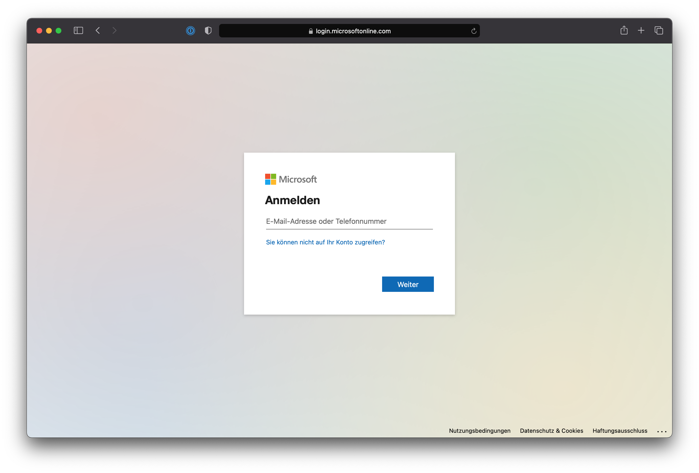

Der LMR-Account ist der Weg, um auf Resourcen in der LMR-Cloud zuzugreifen. Jede Person, die regelmäßig mit LMR-Resourcen arbeitet, sollte einen LMR-Account haben, über den der Zugriff auf diese Resourcen geregelt wird.

Der Benutzername des Accounts ist die **LMR E-Mail Adresse**. In der Regel ist dies eine `@lmr-hh.de` Adresse (in einigen Fällen kann die Adresse auch anders lauten, z.B. verwendet der LJO-Vorstand `@ljo-hamburg.de` Adressen). Der Benutzername und die E-Mail-Adresse ist immer äquivalent.

## Wie melde ich mich bei meinem LMR-Account an?

Man kann an verschiedenen Stellen zur Anmeldung mit dem LMR-Account aufgefordert werden. Einige davon sind:

- Das [Office-Portal](http://office.com/?auth=2)
- Verschiedene Microsoft Apps wie OneDrive, Teams, SharePoint, usw.
- Der Admin-Bereich einiger LMR-Websites
- Beim Verbinden von E-Mail oder Kalender-Apps
- Die Arbeitsplätze in der Geschäftsstelle

Die Login-Seite sieht folgendermaßen aus:

## Was ist die zweistufige Verifizierung?

Für alle LMR-Accounts ist die zweistufige Verifizierung aktiviert. Das bedeutet, dass man zum Anmelden nicht nur ein Passwort, sondern auch eine weitere Verifizierungsmethode benötigt. Die häufigste zweite Methode ist eine SMS, über die man einen Bestätigungscode zugesendet bekommt, den man für die Anmeldung benötigt. Eine weitere sehr bequeme Variante ist die Microsoft Authenticator App.

Für weitere Informationen ist die offizielle [Dokumentation von Microsoft](https://support.microsoft.com/de-de/topic/richten-sie-ihre-microsoft-365-anmeldung-für-die-mehrstufige-authentifizierung-ein-ace1d096-61e5-449b-a875-58eb3d74de14) sehr empfehlenswert.

## Kann ich mich mit dem LMR-Account an PCs anmelden?

Die Arbeitsplätze in der Geschäftsstelle sind so konfiguriert, dass man sich dort ebenfalls mit dem LMR-Account 