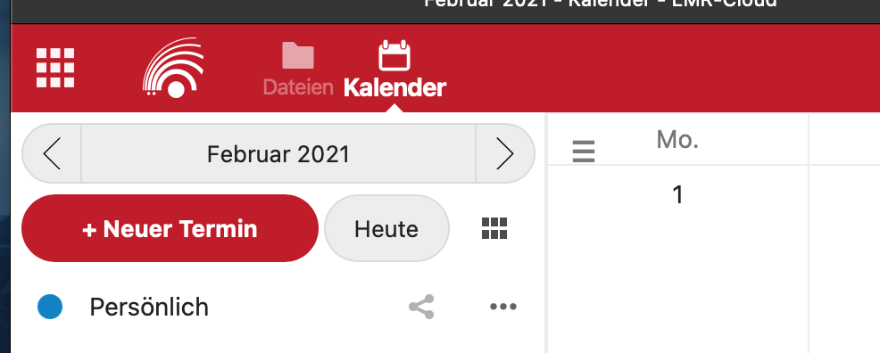
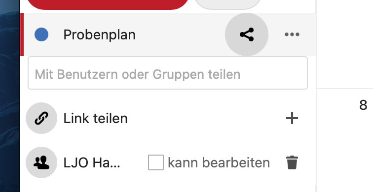

Die LMR-Cloud beinhaltet eine Kalenderfunktion. Diese Seite beschreibt, wie sich die Kalenderfunktion persönlich und gemeinsam nutzen lässt.

## Kalender öffenen

Der Kalender befindet sich unter https://cloud.lmr-hh.de/apps/calendar. Alternativ kann man in der LMR-Cloud auf das Kalendersymbol klicken:

## Kalenderübersicht

Auf der Linken seite erscheint eine Liste von Kalendern. Jeder Kalender enthält beliebig viele Termine. Standardmäßig gibt es einen Kalender mit dem Namen “Persönlich”. Die Termine in diesem Kalender sind nur für dich sichtbar.

Du kannst weitere Kalender erstellen, indem du auf “Neuer Kalender” klickst. Du hast die Möglichkeit, einen Kalender oder eine Aufgabenliste zu erstellen oder kannst einen Online-Kalender abonnieren.

### Gemeinsame Termine

Die Kalender-Funktion ermöglicht es nicht nur, deine eigenen Termine zu verwalten. Man kann auch gemeinsame Termine erstellen (z.B. für Meetings). Erstelle dazu einen neuen Termin (per Klick in die Hauptansicht) und wähle ggf. “Mehr”. Es öffnet sich an der rechten Seite die Detailansicht des Termins. Gib hier den Namen, Zeit sowie ggf. Ort und weitere Informationen für den Termin ein. Du kannst auch einstellen, dass sich der Termin automatisch wiederholt und dass du vor Beginn der Termins per E-Mail oder per Push-Benachrichtigung benachrichtigt wirst.

Um andere Leute zum Termin einzuladen, wähle “Teilnehmer”. Hier kannst du nun alle anderen Teilnehmer des Termins eintragen. Wenn du Leute einladen möchtest, die keinen Account in der LMR-Cloud haben, kannst du ihre E-Mail-Adresse hier angeben. Wenn du dann auf “Speichern” klickst, werden die eingeladenen Personen benachrichtigt.

Wer eingeladen wird, erhält eine Benachrichtigung per E-Mail und kann die Einladung annehmen oder ablehnen. So lässt sich schnell herausfinden, wie viele Teilnehmer an einem Termin tatsächlich Zeit haben. Sollte es später Änderungen an einem Termin geben, kann der Organisator dies einfach tun. Alle Teilnehmer werden dann erneut per E-Mail benachrichtigt.

### Gemeinsame Kalender

Manchmal reicht es nicht aus, einzelne Termine mit anderen Leuten zu teilen. Manchmal möchte man, dass alle Termine in einem Kalender für bestimmte Personen sichtbar sind (z.B. bei Probenplänen, Urlaubskalendern usw.). Das lässt sich durch geteilte Kalender realisieren.

Ein Kalender kann für weitere Personen freigegeben werden, indem man auf das “Teilen”-Symbol klickt und dann weitere Personen oder Gruppen zu dem Kalender hinzufügt. Für jede Person oder Gruppe lässt sich festlegen, ob diese selbst auch Termine bearbeiten und hinzufügen dürfen.

### Öffentliche Kalender

Kalender lassen sich auch über einen Link veröffentlichen. Dann können weitere Leute über den Link auf Termine zugreifen (allerdings nur lesend). Es lässt sich auch ein Link im ICS-Format generieren. Dieser kann dann mit passenden Programmen abonniert werden, oder z.B. auf Websites eingebunden werden.

## Kalenderprogramme verwenden

Die Kalender-Software basiert auf einem etablierten Standard (CalDAV). Dieser kann in vielen Programmen wie Outlook, Apple Calendar, Google Calendar auf Android usw. eingebunden werden. Wie das genau geht, hängt von dem jeweiligen Programm ab. Man benötigt allerdings eine Kalender-Adresse. Diese findet man links unten unter “Einstellungen”. Dort kann man herunterscrollen und dann die CalDAV-Adresse kopieren.