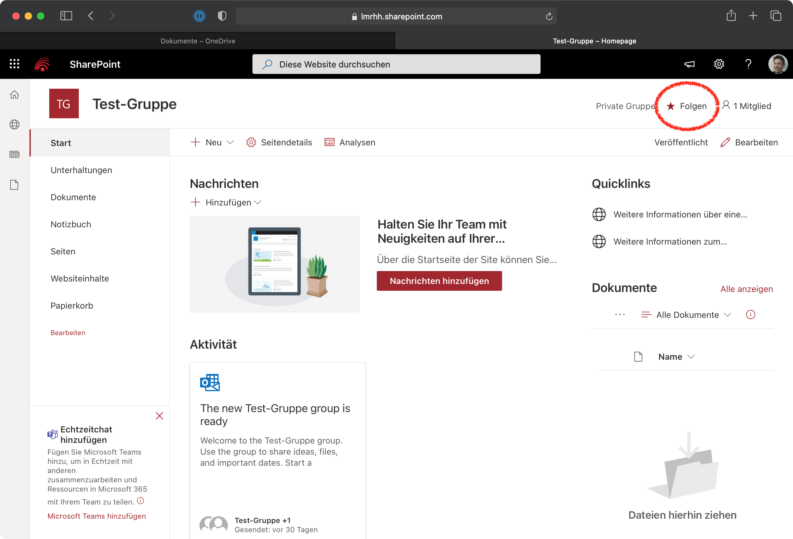
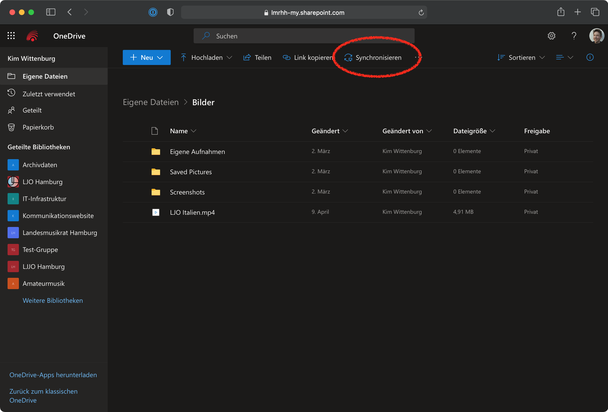

## Zugreifen auf Dateien

Dateien lassen sich in der LMR-Cloud an mehreren Orten finden. Einer der wichtigsten ist [OneDrive](https://lmrhh-my.sharepoint.com). Hier haben Sie auf einer Oberfläche Zugriff auf Ihre eigenen Dateien und auf gemeinsam genutzte Dateien. OneDrive ist unter https://lmrhh-my.sharepoint.com erreichbar und kann auch von der LMR-Cloud-Startseite per Klick auf OneDrive erreicht werden.

## Eigene Dateien

An erster Stelle stehen in OneDrive “Eigene Dateien”. Alle Dateien und Ordner in diesem Bereich sehen nur Sie. Diese Daten sind für niemanden sonst verfügbar. Standardmäßig haben Sie 50GB Speicherplatz im persönlichen Bereich verfügbar. Auf Anfrage kann diese Menge auch erhöht werden.

Sie können Ihre Eigenen Dateien auch mit anderen Nutzern teilen. Dazu klicken Sie neben dem Element, das Sie teilen möchten auf das Teilen-Symbol und können darüber weitere Personen zur Datei oder zum Ordner hinzufügen. Hier können Sie auch öffentliche Links für Dateien erstellen.

Wenn jemand Sie zur Zusammenarbeit an einer Datei oder einem Ordner hinzufügt, erscheint dies bei Ihnen unter “Geteilt” in OneDrive. Sie erhalten außerdem i.d.R. eine E-Mail, wenn jemand eine Datei oder einen Ordner mit Ihnen teilt.

## Geteilte Bibliotheken

Über OneDrive können Sie auch auf gemeinsame Ordner zugreifen, die für die verschiedenen Projekte und Bereiche des LMR eingerichtet wurden. Dazu ist allerdings ein zusätzlicher Schritt erforderlich:

1. Erfragen Sie für das Projekt, bzw. den Ordner auf den Sie Zugriff brauchen bei Kim Wittenburg die Berechtigung an. Sie erhalten in der Antwort einen Link zu einer SharePoint-Seite.
2. Öffnen Sie den Link und klicken Sie rechts oben auf “Sie folgen nicht”, um der Seite zu folgen. Das ist notwendig, damit die Seite in OneDrive sichtbar ist.
3. Wechseln Sie zurück zu OneDrive. Die geteilten Dokumente sind jetzt unter “Geteilte Bibliotheken” sichtbar.

## Dateien lokal synchronisieren

Sie können Ordner oder auch nur einzelne Unterordner lokal synchronisieren. Laden Sie dazu die [OneDrive App](https://www.microsoft.com/de-de/microsoft-365/onedrive/download) herunter und installieren Sie sie. Navigieren Sie dann in OneDrive zu dem Ordner, den Sie synchronisieren möchten. Wählen Sie in der Toolbar “Synchronisieren”. Die OneDrive App öffnet sich automatisch und fordert Sie dazu auf, sich anzumelden. Melden Sie sich mit Ihren LMR-Account an. Dann ist der gewählte Ordner im Windows Explorer, bzw. Mac Finder zu finden.

