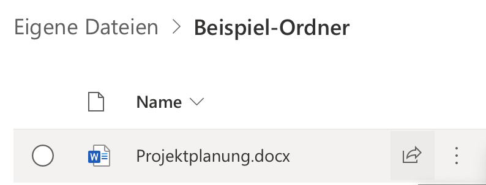
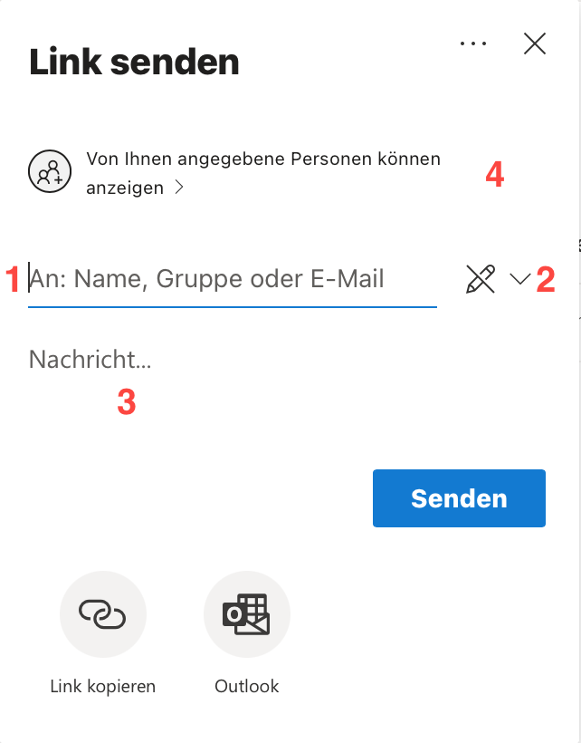
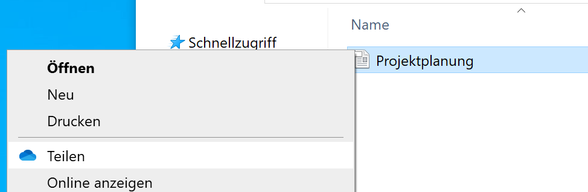
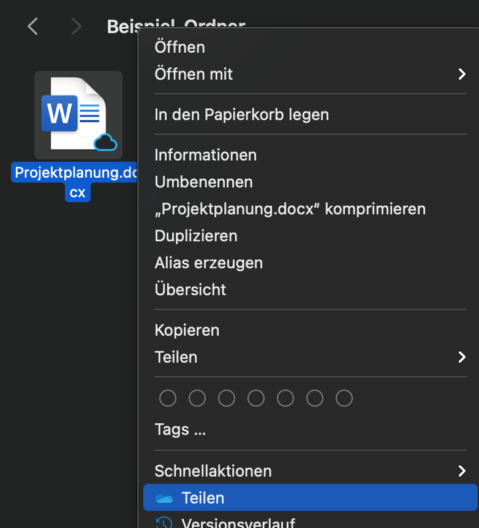

In diesem Artikel werden mehrere Möglichkeiten gezeigt, um Dateien und Ordner für andere Personen freizugeben.


  Das externe Teilen von Dateien wurde auch in einem [Schulungsvideo](https://web.microsoftstream.com/video/720bd599-4476-4c22-ac7d-4f5856d721c7?st=1967) behandelt.


## Wann sind Dateifreigaben notwendig?

Innerhalb von Projektordnern sind die Zugriffsrechte auf Dateien bereits zentrale geregelt. Wenn also eine Projektleitung und eine Projektassistenz auf dieselbe Datei zugreifen möchten, sind die nötigen Berechtigungen i.d.R. bereits eingestellt und die Datei kann von beiden Personen abgerufen werden. In den meisten Fällen sollte Zusammenarbeit auf diese Weise gelöst werden.

Es gibt allerdings Fälle, in denen man mit Personen zusammenarbeiten möchte, die sonst keinen Zugriff auf eine Datei haben. Das können externe Mitarbeiter sein oder es kann sich um Dateien handeln, die man mit einer bestimmten anderen Person besprechen möchte. Dies lässt sich durch Dateifreigaben lösen.

## Dateien über OneDrive im Web freigeben

Es ist möglich, Dateien einfach über das OneDrive Webinterface freizugeben. Dazu klickt man neben der Datei oder dem Ordner, den man freigeben möchte auf den “Teilen”-Button:

Es öffnet sich ein Popup, wie das folgende:

Hier können folgende Einstellungen getätigt werden:

- **1**: Es können die Namen oder E-Mail-Adressen der Personen eingetragen werden, die auf die freigegebene Datei zugreifen dürfen. Alle hier angegebenen Personen erhalten eine E-Mail mit einer Benachrichtigung, dass sie nun Zugriff auf die Datei oder den Ordner haben.
- **2**: Es kann eingestellt werden, ob die Empfänger die freigegebenen Daten nur lesen dürfen oder ob sie diese auch bearbeiten dürfen. Die Standardeinstellung erlaubt nur den Lesezugriff auf Dateien.
- **3**: Sie können eine Nachricht angeben, die die Empfänger zusammen mit der Dateifreigabe erhalten. Hier können Sie die Empfänger beispielsweise darum bitten, ein Dokument zu kommentieren.
- **4**: Es ist möglich, andere Linktypen zu erstellen. Für die meisten Fälle sind die Standardeinstellungen gut geeignet. Falls es notwendig ist, einen weltöffentlichen Link zu erstellen, ist dies möglich, indem hier die Zielgruppe geändert wird. Hier ist es auch möglich, einen Link für Leute zu kopieren, die bereits Zugriff auf die Datei haben.

Nach einem Klick auf “Senden” ist die Dateifreigabe erstellt.

## Dateien freigeben, die auf Windows synchronisiert sind

Um Dateien freizugeben, die mit dem OneDrive Synchronisationsclient auf Windows synchronisiert werden, braucht man nicht die OneDrive-Website zu benutzen. Dateie lassen sich direkt per Rechtsklick mit anderen Personen teilen. Es öffnet sich dasselbe “Teilen”-Fenster, das oben bereits beschrieben ist.

Diese Funktion ist auch für Dateien verfügbar, die auf dem Desktop synchronisiert sind.

## Dateien freigeben, die auf macOS synchronisiert sind

Um Dateien freizugeben, die mit dem OneDrive Synchronisationsclient auf macOS synchronisiert werden, braucht man nicht die OneDrive Website zu benutzen. Dateien lassen sich direkt per Rechtsklick mit anderen Personen teilen. Es öffnet sich dasselbe “Teilen”-Fenster, das oben bereits beschrieben ist.

## Fehlerbehandlung

### Ich habe einen Link erhalten, kann die Datei aber nicht bearbeiten

Das liegt meistens daran, dass die Datei nicht mit Schreibberechtigungen freigegeben wurde. Bitten Sie den Absender der Freigabe darum, Ihnen Schreibrechte zu geben.

In seltenen Fällen kann es auch sein, dass die Online-Version von Office einen Moment braucht, bis die Bearbeitungsfunktion aktiviert ist. Besonders bei schlechten Internetverbindungen kann dies bis zu 1 Minute dauern.

### Ich kann keine weltöffentlichen Links erstellen

Weltöffentliche Links können für Eigene Dateien in OneDrive erstellt werden, allerdings nicht für Dateien in Projektordnern. Das ist beabsichtigt. Überlegen Sie sich, ob es wirklich notwendig ist, die Dateien weltöffentlich freizugeben oder ob Sie den Empfängern auch über den normalen Freigabemechanismus Zugriff auf die Dateien geben können.

Sollte ein weltöffentlicher Link erforderlich sein, wenden Sie sich an den IT-Support.
