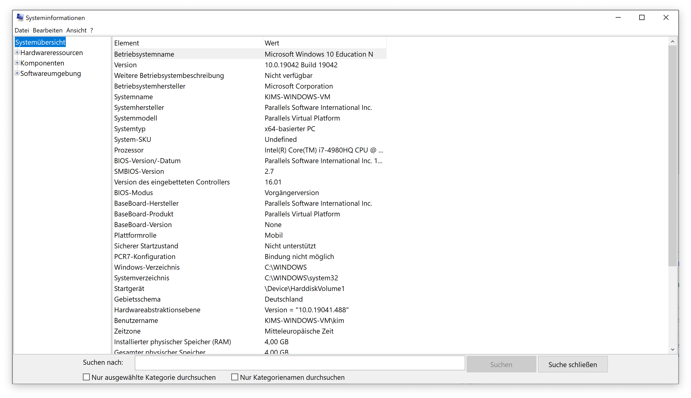

Um Probleme mit einem Computer effektiv lösen zu können, ist es manchmal hilfreich, genaue Informationen über die verbaute Hardware zu bekommen. Diese Anleitung zeigt, wie man die Hardwareinformationen sammeln und verschicken kann.

## Systeminformationen öffnen

Drücke auf der Tastatur die Windows-Taste und R gleichzeitig. Es öffnet sich ein kleines Fenster mit einem Textfeld. Gib dort `msinfo32` ein und klicke OK.

## Bestimmte Systeminformationen auslesen

In dem jetzt geöffneten Fenster lassen sich viele Informationen zum verwendeten System herausfinden. Zum Beispiel stehen hier CPU-Modell, Menge und Art des Arbeitsspeichers usw. Wenn nach einer bestimmten Information gesucht wird, ist sie i.d.R. hier zu finden.

## Vollständigen Systembericht erstellen

Um einen vollständigen Systembericht zu erstellen, kannst du auf **Datei > Exportieren** klicken. Wähle einen Ort und einen Dateinamen für den Bericht und klicke auf “Speichern”. Das Erstellen des Berichts dauert eine Weile. Wenn der Bericht fertig ist, kannst du ihn z.B. per E-Mail verschicken.

