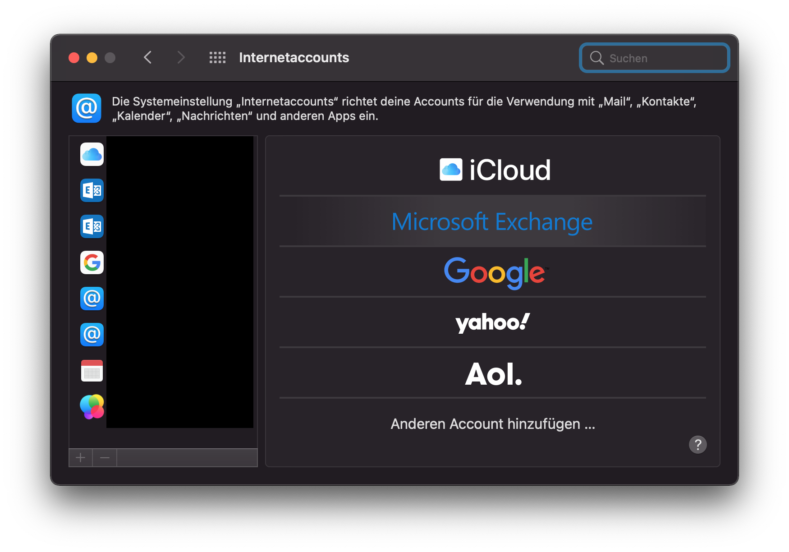

Das Standard Mail-Programm von Apple lässt sich sehr einfach mit dem LMR-Account verbinden. Diese Anleitung ist für macOS 11 (Big Sur) geschrieben, sollte aber in ähnlicher Form auch auf älteren oder neueren Systemen anwendbar sein.

1. Zum Einrichten des Postfachs gehen Sie in macOS in die Systemeinstellungen zu “Internetaccounts”.
2. Dort wählen Sie rechts “Microsoft Exchange”. Sie haben nun die Möglichkeit einen Namen und eine E-Mail-Adresse anzugeben. Der Name wird als Absender verwendet (Empfehlung: Geben Sie hier Ihren vollen Namen an). Die E-Mail-Adresse ist Ihre LMR-Adresse (endet i.d.R. mit `@lmr-hh.de`).
3. Klicken Sie auf “Anmelden”. Sie werden gefragt, ob Sie sich über Microsoft bei dem Exchange-Account anmelden möchten. Klicken Sie erneut auf “Anmelden”
4. Geben Sie im Folgenden Ihr Passwort und den Code für die zweistufige Bestätigung an.
5. Sie haben am Ende der Einrichtung die Möglichkeit, neben Mails auch Kalender, Kontakte, Notizen und Erinnerungen einzurichten. Wenn Sie für Ihre Kalenderverwaltung das Kalender-Programm von Apple benutzen, sollten Sie neben Mail auch Kalender **und** Kontakte aktivieren. Wenn die Kontakte deaktiviert sind, sind einige Funktionen wie z.B. das öffnen gemeinsamer Kalender nicht verfügbar.

