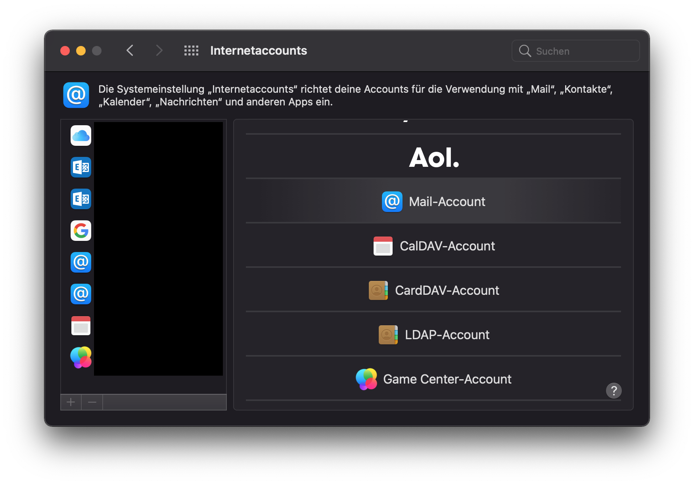
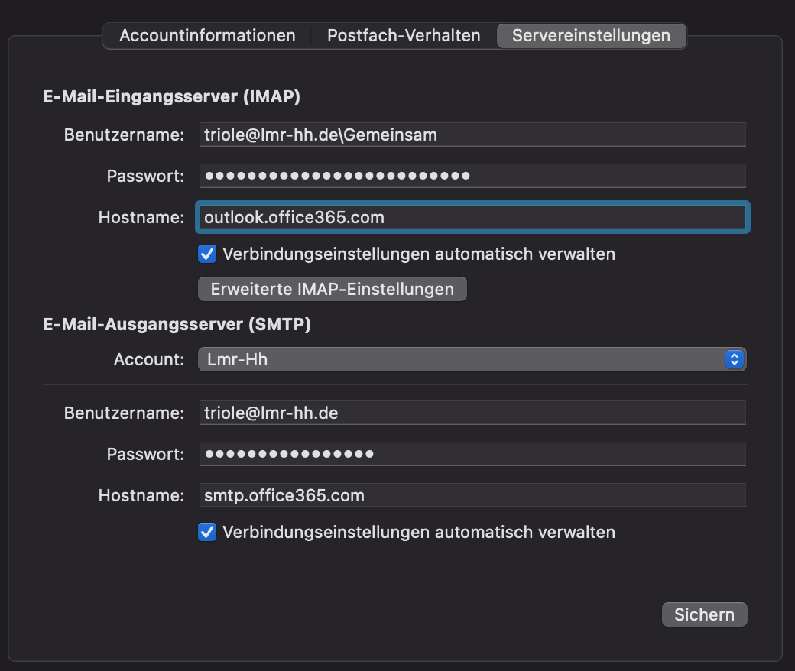

Die Einrichtung von geteilten Postfächern auf Apple Mail unter macOS ist etwas aufwändiger.


Bevor Sie geteilte Postfächer mit Apple Mail nutzen können, muss Ihr Account für die Nutzung von App-Kennwörtern freigeschaltet werden. Wenden Sie sich dazu bitte an den LMR [IT-Support](mailto:support@lmr-hh.de).


## Schritt 1: App-Kennwort erstellen

Um das geteilte Postfach anzubinden, ist ein App-Kennwort erforderlich. Folgen Sie dieser Anleitung, um ein [App-Kennwort zu erstellen](/account/app-password). Notieren Sie sich das Kennwort, da es für die folgenden Schritte gebraucht wird.

## Schritt 2: Account hinzufügen

Mit den folgenden Schritten können Sie das geteilte Postfach zu Apple Mail hinzufügen. Dafür brauchen Sie die ID und die primäre Adresse des geteilten Postfachs. Für dieses Beispiel verwenden wir die ID `Gemeinsam` und die primäre Adresse `gemeinsam@lmr-hh.de`. Es wird außerdem als Beispiel der LMR-Account `triole@lmr-hh.de` benutzt. Wenn Sie das Postfach einrichten, verweden Sie stattdessen Ihren LMR-Account.

- Öffnen Sie die macOS-**Systemeinstellungen** und gehen Sie zu **Internetaccounts** und dort einen Account hinzufügen.
- Wählen Sie **Anderen Account hinzufügen…** und dann **Mail-Account**
  
- Geben Sie nun folgende Daten ein:
  - **Name**: Beliebig, am besten verwenden Sie Ihren eigenen Namen. Dieser Name wird z.T. als Absendername verwendet.
  - **E-Mail-Adresse**: Die E-Mail-Adresse des geteilten Postfachs, also in diesem Beispiel `gemeinsam@lmr-hh.de`.
  - **Passwort**: Geben Sie hier das in Schritt 1 erstellte App-Kennwort ein.
- Klick auf **Weiter**. Die Einrichtung wird zunächst fehlschlagen und es werden weitere Eingabefelder angezeigt. Dort müssen die folgenden Dinge eingegeben werden:
  - **E-Mail-Adresse**: Hier ist die E-Mail-Adresse des geteilten Postfachs bereits ausgefüllt. Lassen Sie dies stehen.
  - **Benutzername**: `<LMR-Adresse>\<Postfach-ID>`. In diesem Beispiel geben wir also `triole@lmr-hh.de\Gemeinsam` an.
  - **Accounttyp**: IMAP
  - **Server für eintreffende Mails**: [outlook.office365.com](https://outlook.office365.com)
  - **Server für ausgehende Mails**: [smtp.office365.com](https://smtp.office365.com)
- Weiter und Fertig. (Die Notizen brauchen nicht ausgewählt sein)

## Schritt 3: SMTP-Einstellungen ändern

Nach Schritt 2 können Sie E-Mails des geteilten Postfachs empfangen. Allerdings funktioniert das Senden von Mails noch nicht. Dazu müssen Sie eine Einstellung ändern, die bei der Konfiguration automatisch falsch gesetzt wird. Öffnen Sie dazu das Programm **Mail** und öffnen Sie die **Einstellungen**.

- Wählen Sie den Tab **Accounts** und wählen Sie dort in der Liste links den Account des geteilten Postfachs, den Sie in Schritt 2 hinzugefügt haben. Standardmäßig heißt dieser `Lmr-hh`.
- *Optional*: Ändern Sie die **Beschreibung** des Accounts, um ihn leichter zu identifizieren.
- Gehen Sie zum Tab **Servereinstellungen** des Accounts.
- Im unteren Bereich befindet sich der **E-Mail-Ausgangsserver (SMTP)**. Ändern Sie dort den **Benutzernamen** zu Ihrer LMR-Adresse. Standardmäßig ist dort ein Benutzernamen nach dem Schema `<LMR-Adresse>\<Postfach-ID>` eingestellt, der aber nicht funktioniert.
- Klicken Sie auf **Sichern**

Nachdem Sie diese Schritte durchgeführt haben, können Sie E-Mails im Namen des geteilten Postfachs senden.


Der eingestellte Benutzername in Schritt 3 hat keine Auswirkung auf die Absender-Adresse. Der Benutzername wird lediglich verwendet, um das Passwort zu überprüfen. Als Absenderadresse wird trotzdem die Adresse des geteilten Postfachs verwendet.


