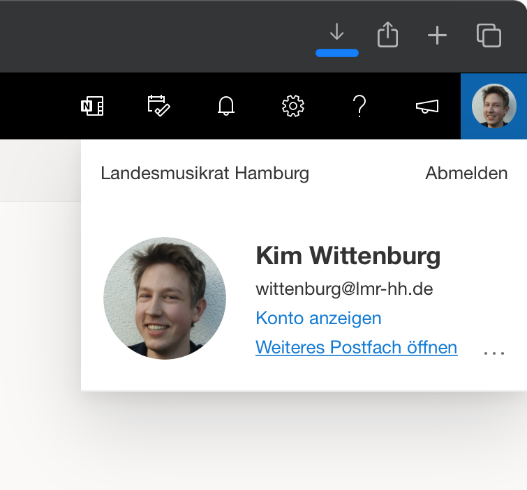

In der Outlook Web App ist es sehr einfach möglich, auf geteilte Postfächer zuzugreifen (vorausgesetzt die notwendigen Berechtigungen wurden erteilt). Dazu klickt man rechts oben auf das eigene Profilbild, bzw. die eigenen Initialien, und wählt “Weiteres Postfach öffnen”.

In dem darauffolgenden Dialog kann man die E-Mail-Adresse des Postfachs eingeben, das geöffnet werden soll und das Postfach durch einen Klick auf “Öffnen” in einem neuen Tab öffnen.

