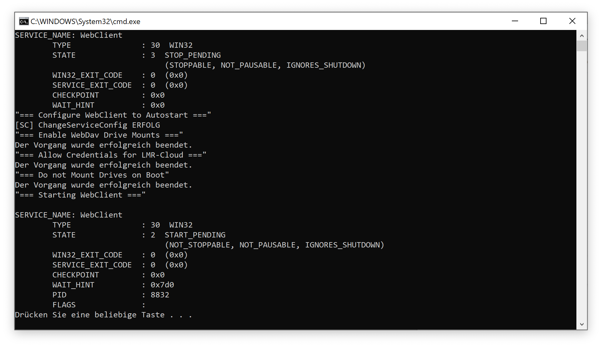
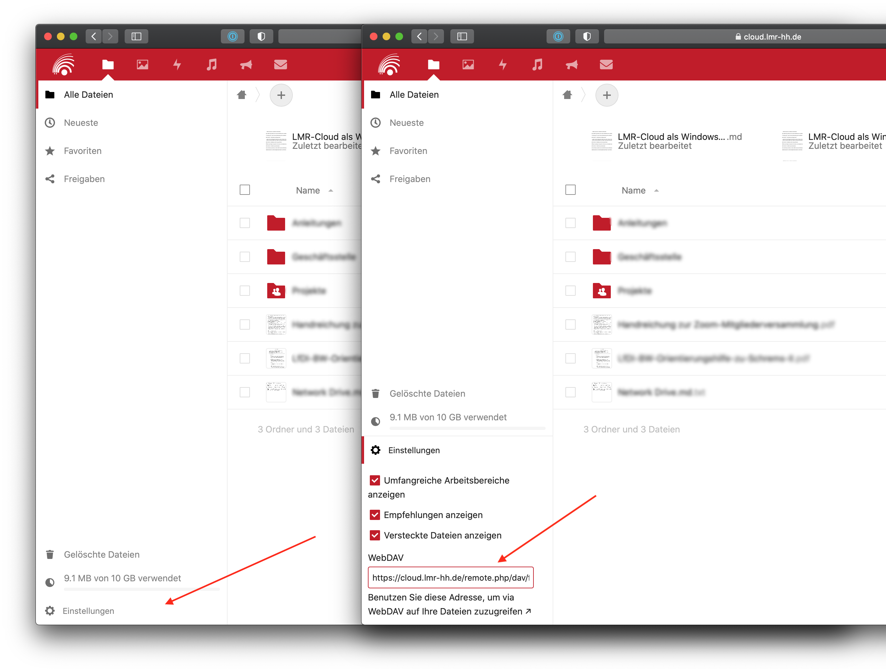
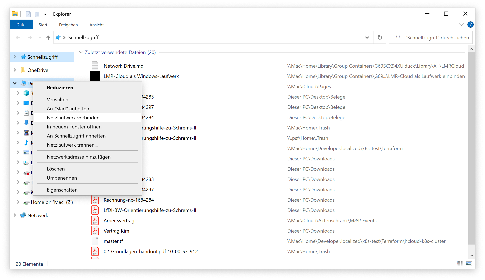
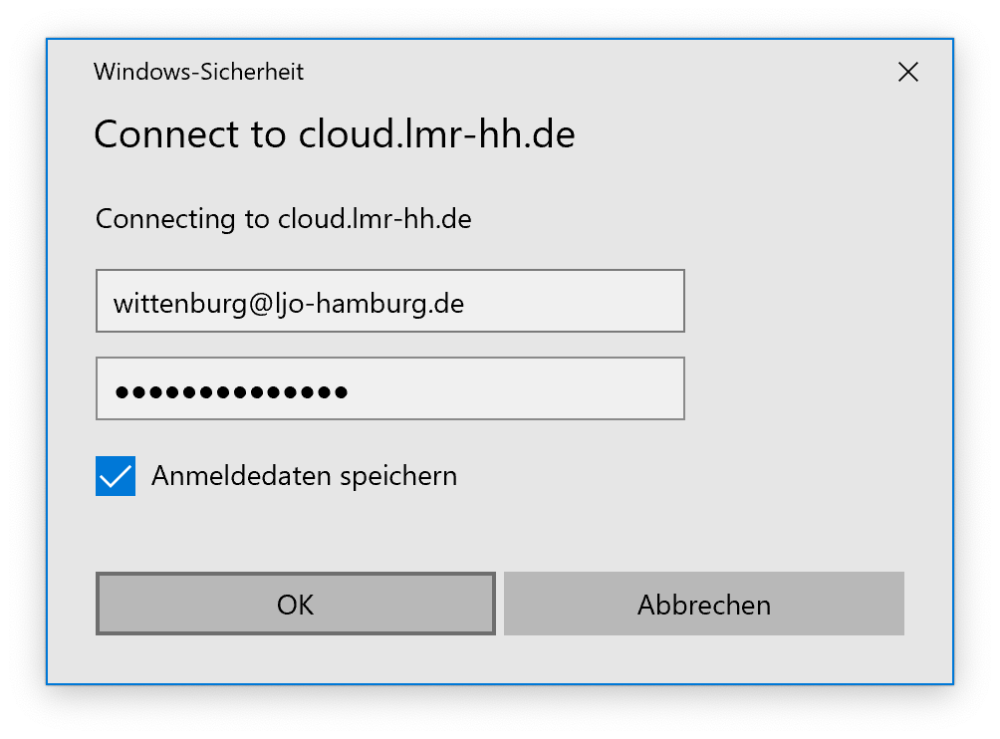

Die LMR-Cloud lässt sich unter Windows als Laufwerk einbinden, sodass man mit Dateien in der Cloud wie mit einem lokalen Ordner arbeiten kann. In dieser Anleitung wird beschrieben, wie sich diese Funktion aktivieren lässt.

**Achtung**: Durch eine Einbindung als Laufwerk werden *keine* Daten synchronisiert. Dafür wird ein separates Programm gebraucht, wie z.B. der offizielle NextCloud Client. Für Details siehe [hier](https://cloud.lmr-hh.de/s/QWAggprf3aezyEY).

## Schritt 1: Windows konfigurieren

- Laden Sie die folgende Datei herunter: [Link](webdav.bat)
- Führen Sie die Datei aus. Dafür sind Administratorenrechte erforderlich. Es öffnet sich ein Fenster, dass etwa wie das folgende aussieht. Drücken Sie `Enter`, um das Fenster zu schließen.

## Schritt 2: WebDav-URL herausfinden

Öffnen Sie https://cloud.lmr-hh.de/ und melden Sie sich an. Klicken Sie links unten auf “Einstellungen” und kopieren Sie die WebDAV-Adresse.

## Schritt 3: LMR-Cloud einbinden

Als nächstes werden wir die LMR-Cloud als Windows-Laufwerk einbinden. Öffnen Sie dazu den Windows Explorer. Per Rechtsklick auf “Dieser PC” wählen Sie “Netzlaufwerk verbinden” (engl.: “Map Network Drive”).

Konfigurieren Sie das Laufwerk im folgenden Fenster auf die folgende Weise:

- Laufwerk: Egal (die Standardeinstellung wählt einen verfügbaren Laufwerksbuchstaben automatisch aus)
- Ordner: Geben Sie hier die WebDAV-Adresse aus Schritt 2 ein.
- „Verbindung bei Anmeldung wiederherstellen“ auswählen (sonst verschwindet das Laufwerk nach einem Neustart)
- “Verbindung mit anderen Anmeldedaten herstellen” auswählen (sonst versucht sich Windows mit dem Anmeldepasswort von Windows zu verbinden)

Wählen Sie danach “Fertig stellen“.

Geben Sie Ihren Benutzernamen und Passwort für die LMR-Cloud ein. Wählen Sie “Anmeldedaten speichern”.

Nach der Bestätigung ist das Laufwerk verbunden und erscheint im Windows-Explorer.

### Optional: Laufwerk umbenennen

Es empfielt sich, das eingebundene Laufwerk umzubenennen, um es leichter wiederzuerkennen. Wählen Sie dazu per Rechtsklick auf das Laufwerk “Umbenennen” und vergeben Sie einen neuen Namen (z.B. “LMR-Cloud”).

**Hinweis**: In einigen Fällen muss man das Laufwerk nach einem Neustart erneut umbenennen. Beim zweiten Mal sollte der neue Name dann aber korrekt gespeichert werden.

