In diesem Artikel wird erklärt, wie man einen oder mehrere Ordner aus der LMR-Cloud mit lokalen Ordnern automatisch synchronisieren kann.

## Schritt 1: NextCloud Client Installieren

Der [NextCloud Client](https://nextcloud.com/de/clients/) synchronisiert Dateien aus der LMR-Cloud in einen lokalen Ordner. Er kann [hier](https://nextcloud.com/de/clients/) heruntergeladen werden.

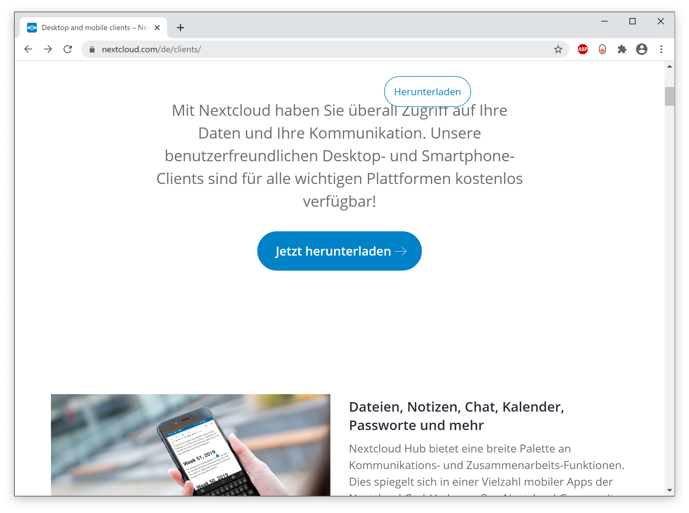
Die Installation des NextCloud-Client erfolgt nach den üblichen Methoden für das Betriebssystem. Die Screenshots zeigen ein Windows-System, ähnliche Schritte sind aber auch für macOS und Linux erforderlich. Die Integration in den Windows Explorer ist nicht unbedingt notwendig, ist aber empfehlenswert.

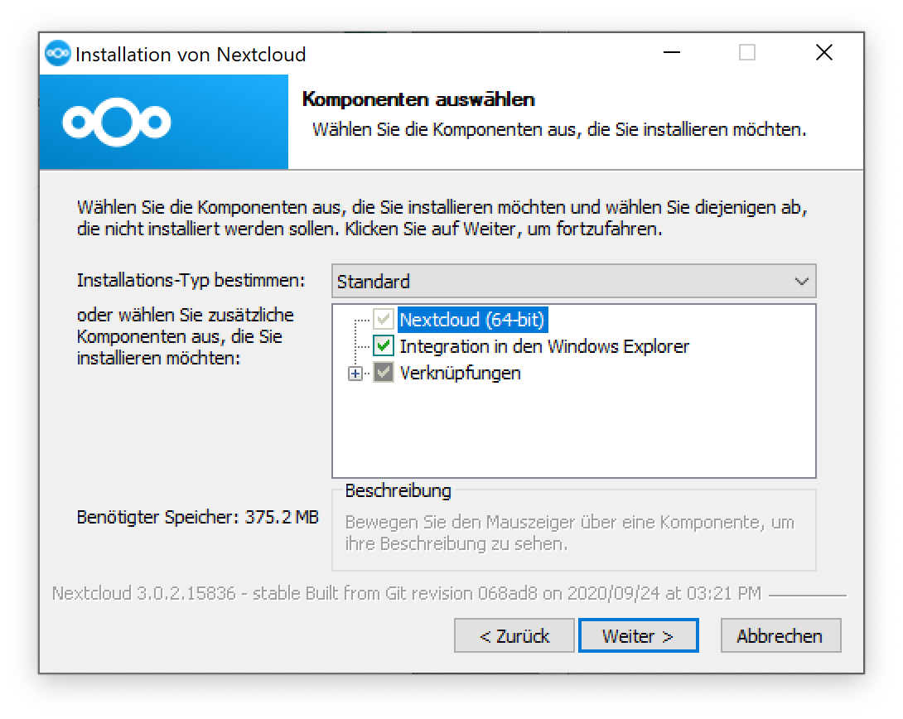

## Schritt 2: Anmelden in der LMR-Cloud
Nach der Installation muss der NextCloud Client mit der LMR-Cloud verbunden werden. Dazu öffnet man das gerade installierte Programm und wählt *Anmelden*. Die Serveradresse ist `https://cloud.lmr-hh.de`. Danach wählt man *Weiter*.


In diesem Schritt sollten Sie nicht „Bei einem Anbieter registrieren“ wählen. Der „Weiter“-Button befindet sich rechts unten.

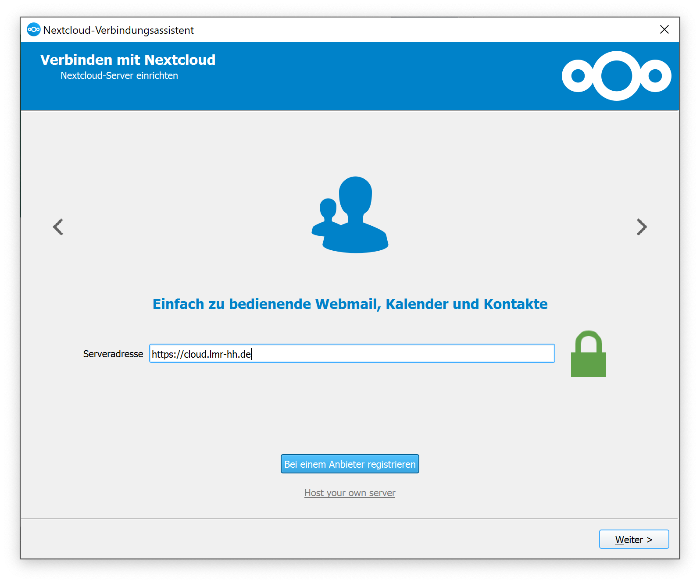

Es öffnet sich daraufhin ein Browser-Fenster, in dem man sich in der LMR-Cloud anmeldet. Möglicherweise geschieht dies auch in einigen Fällen automatisch.
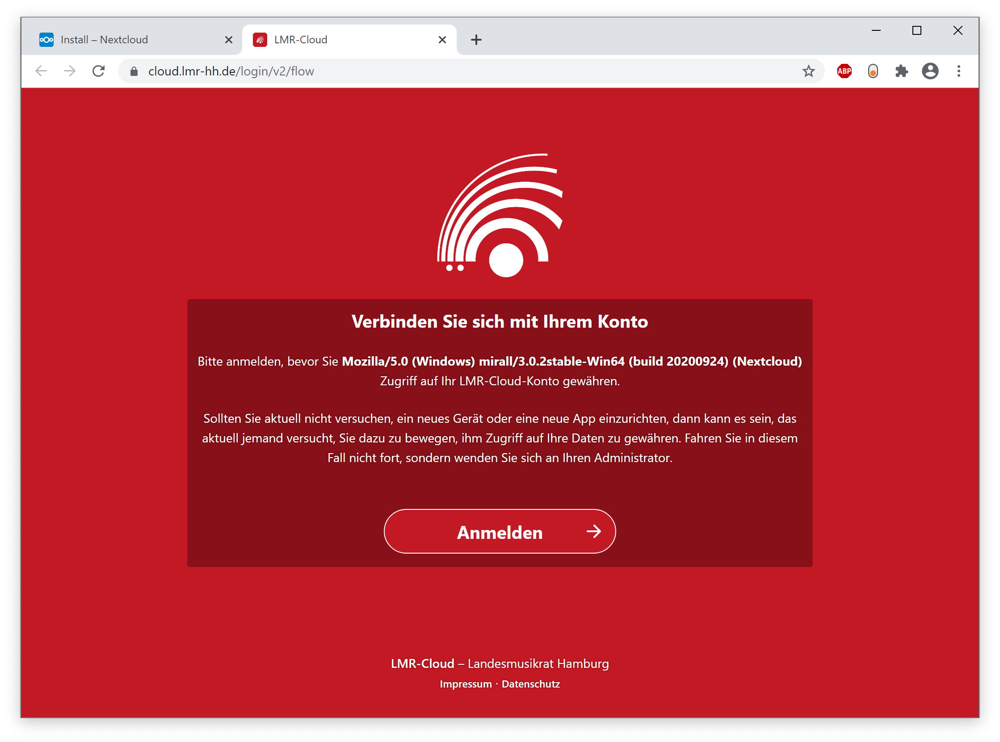
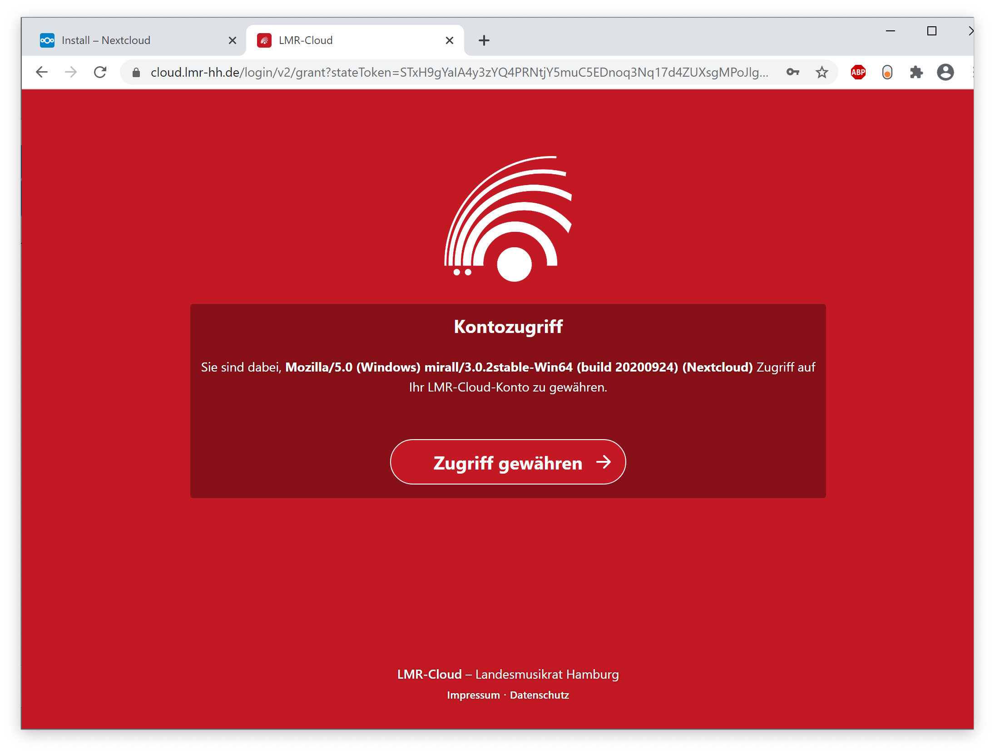

Zurück im NextCloud Client Programm (dieser hat ein Symbol in der Windows-Taskleiste bzw. in der Mac-Statusleiste) lässt sich auswählen, welche Daten vom Server synchronisiert werden sollen. Es ist empfehlenswert nur einige Ordner zu synchronisieren, um nicht zu viel Speicherplatz zu verwenden. In diesem Beispiel synchronisiere ich nur den Ordner „LJO Hamburg“.


Bei vielen Ordnern wird fälschlicherweise „0 B“ als Größe angezeigt. Tatsächlich können diese Ordner aber sehr groß sein. In den meisten Fällen möchte man vermutlich nur einige Unterordner synchronisieren, an denen aktiv gearbeitet wird.


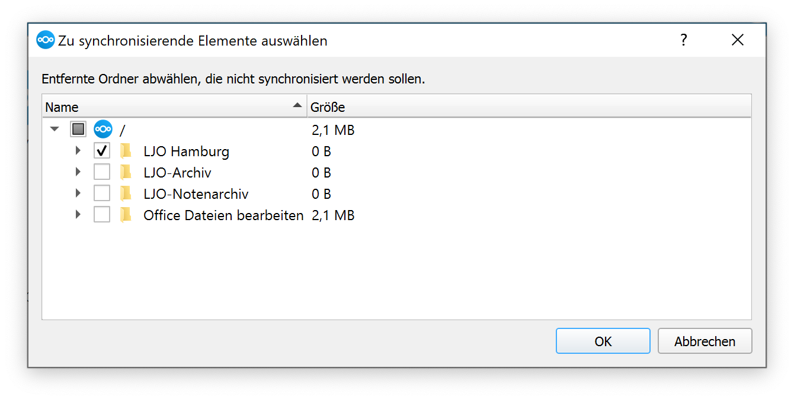
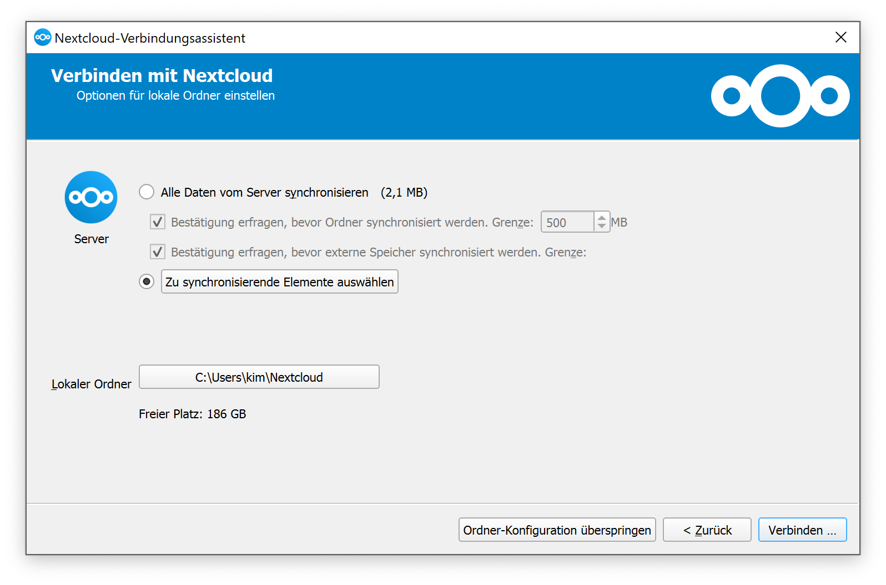

Nach einem Klick auf „Verbinden“ schließt sich das Fenster.


In einigen Fällen erscheint nun eine Warnung, dass externe Speicher nicht synchronisiert werden können. Um dies zu beheben, müssen folgende Schritte ausgeführt werden:

1. Öffne die NextCloud-Einstellungen (NextCloud hat ein Symbol in der Taskbar bei Windows bzw. in der Statusleiste bei macOS).
2. **Möglichkeit 1**: Aktiviere den Haken bei dem zu synchronisierenden Ordner erneut und bestätige diese Manuelle Änderung.
3. **Möglichkeit 2**: Unter „Allgemein“ lassen sich Warnungen zur Synchronisation externer Speicher deaktivieren. Dies verhindert erneute Warnungen in der Zukunft.
4. Wähle „Manuelle Änderungen anwenden“, um die Synchronisation zu starten: 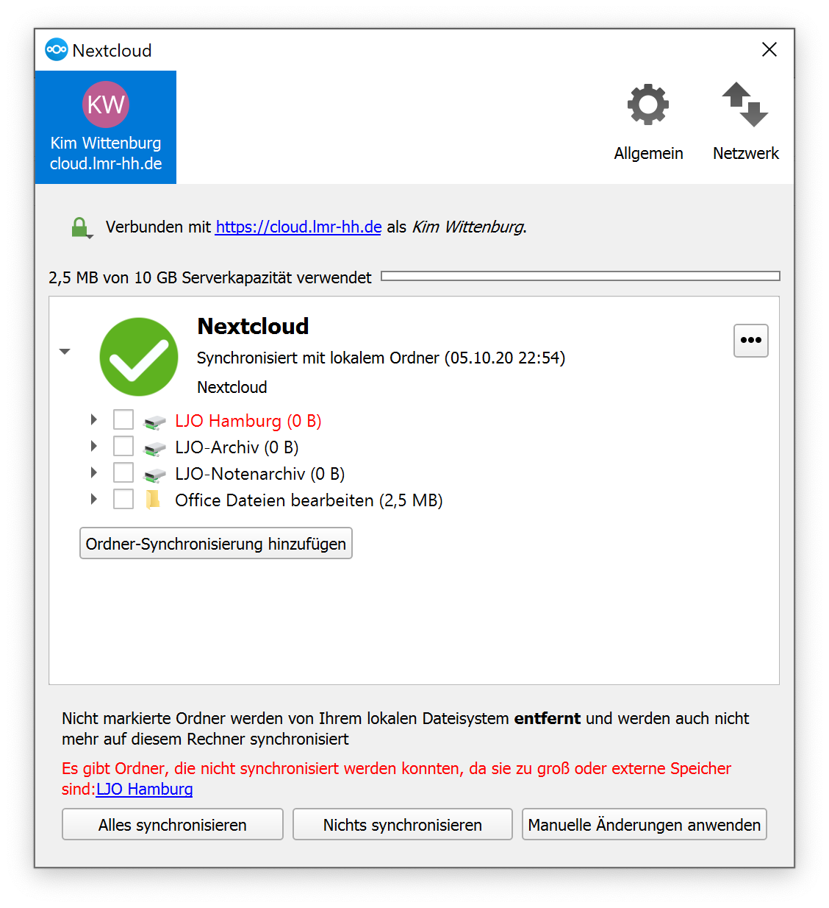

Um zukünftige Fehler zu umgehen, lässt sich der Bestätigungsschritt für externe Ordner deaktivieren. In diesem Beispiel wird NextCloud außerdem mit dem System gestartet: 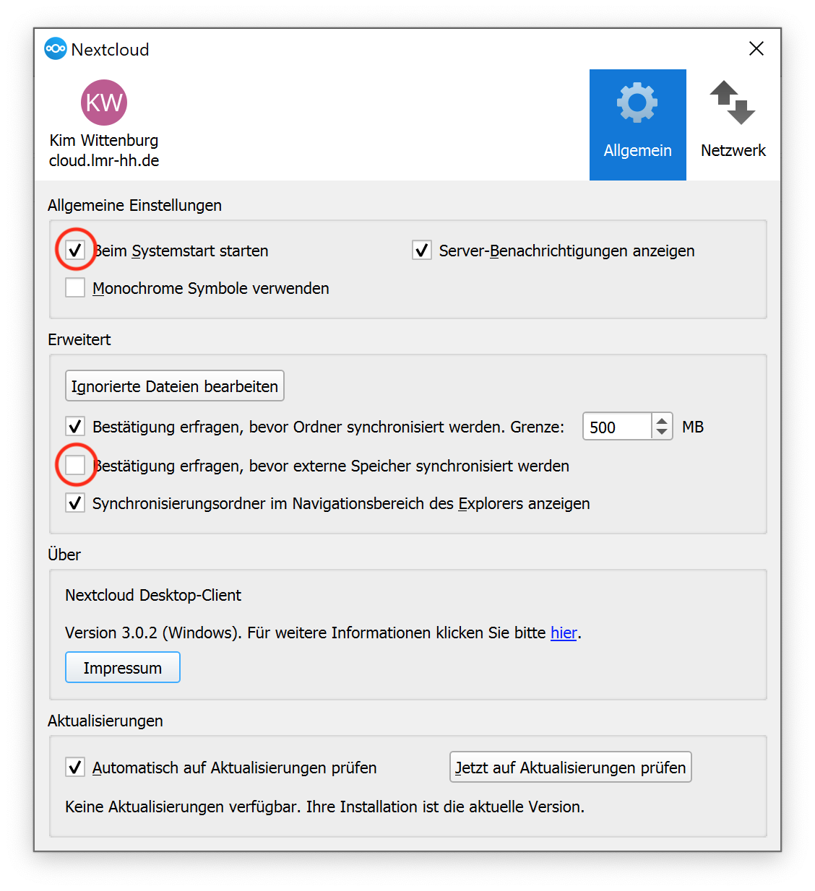

Nach dem Anwenden der Änderung startet die Synchronisation.
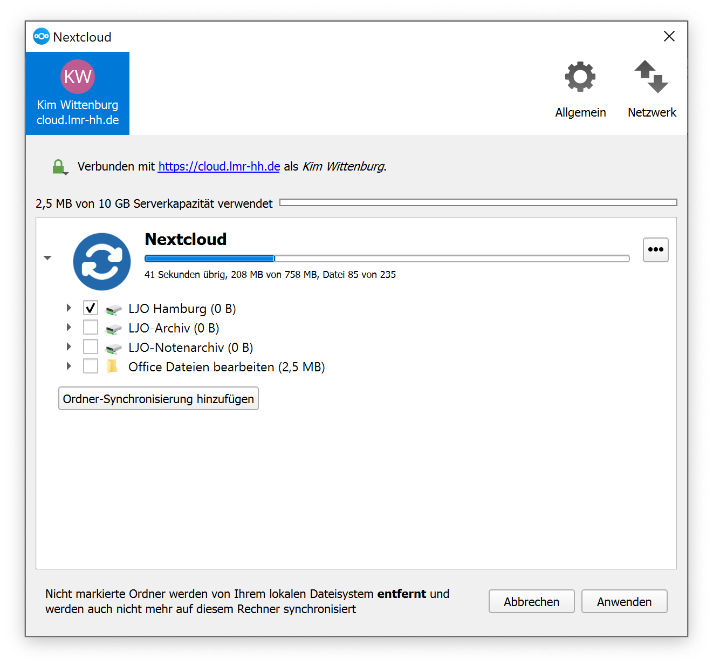


## Schritt 3: Dateien lokal bearbeiten

Es befindet sich nun ein Ordner in dem in Schritt 2 angegebenen Pfad. Wenn bei der NextCloud-Installation die Integration in den Windows Explorer ausgewählt wurde, befindet sich auch ein „Nextcloud“-Eintrag in der Seitenleiste. Dort können nur Dateien ganz normal mit lokalen Programmen wie Microsoft Office bearbeitet werden. Alle Änderungen werden beim Speichern automatisch in die LMR-Cloud synchronisiert (bzw. wenn das nächste Mal eine Internetverbindung besteht).

Sollte keine Internetverbindung bestehen, werden Änderungen synchronisiert, sobald wieder eine Internetverbindung vorhanden ist.

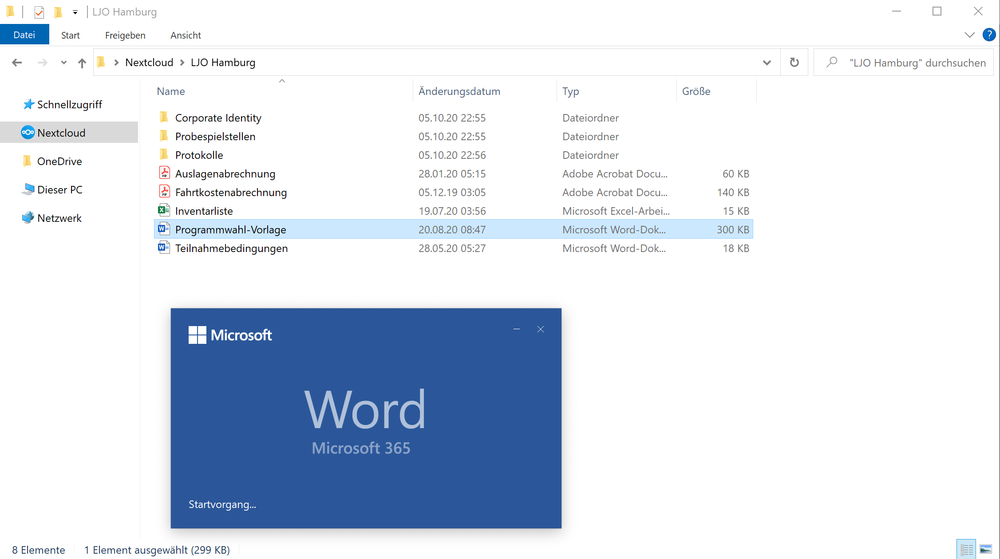

## Weitere Ordner synchronisieren

Es ist möglich, mit NextCloud verschiedene Unterordner zu synchronisieren. Um diese Einstellungen zu ändern, kann man die NextCloud-Einstellungen aufrufen (vgl. Schritt 2) und dort die Auswahl ändern. Es ist auch möglich, mehrere Ordner an verschiedene Stellen zu synchronisieren, indem man „Ordner-Synchronisation hinzufügen“ wählt. Im Normalfall ist das Feature aber nicht notwendig.

Es ist auch möglich, mehrere NextCloud-Accounts zu synchronisieren, falls bereits Zugriff auf eine andere NextCloud-Instanz besteht.